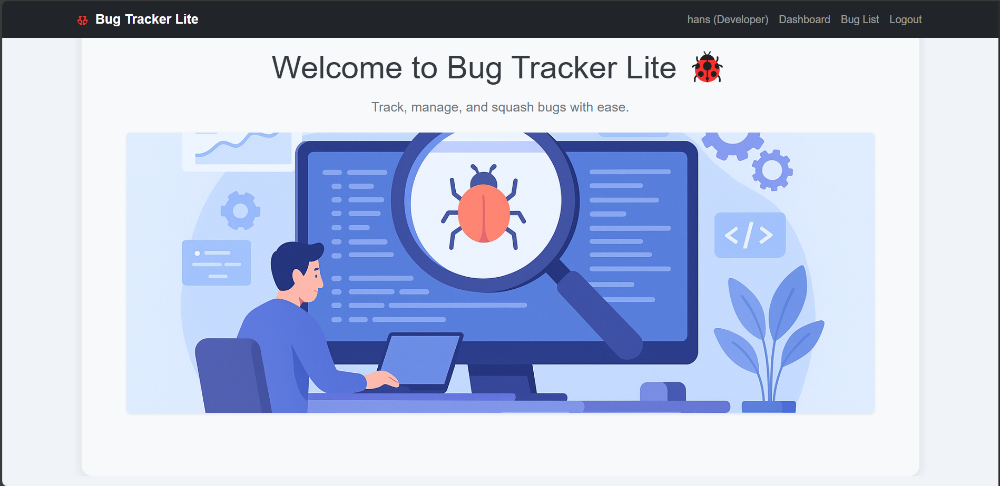
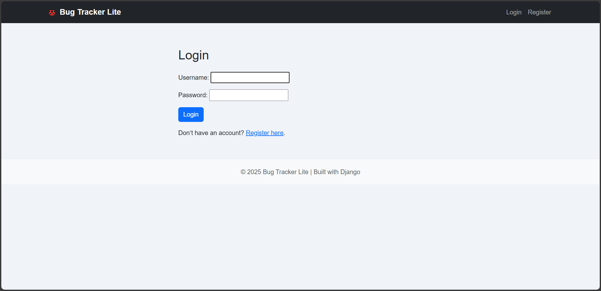
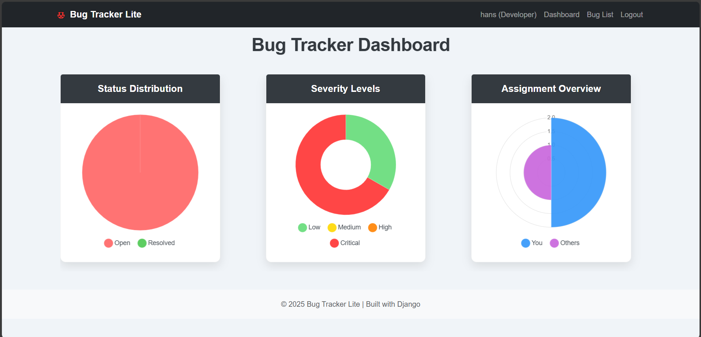
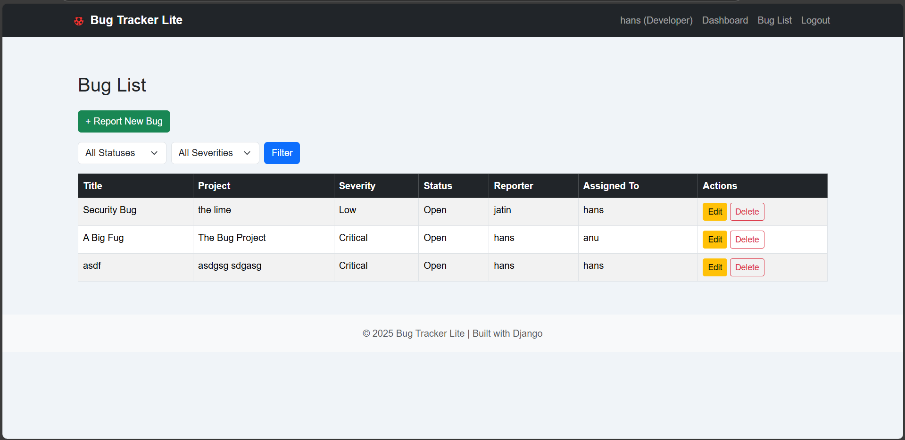

# 🐞 Bug Tracker Lite

**Bug Tracker Lite** is a lightweight, minimalist issue management system built using Django. It allows developers and teams to track, manage, and resolve software bugs efficiently. This project focuses on functionality, clarity, and simplicity—making it ideal for internal teams or solo developers who need a fast, no-frills way to manage bug reports.

---

## Overview

The system includes core bug tracking features: user authentication, bug creation, assignment, status management, and a visual dashboard to get an at-a-glance view of all bugs in the system. The frontend uses Bootstrap for a clean and responsive UI, with custom styling to enhance readability and professional appearance. Designed as a fully local project, it can also be easily deployed to the cloud with a few changes.

---

## Features

- Full authentication system (Register, Login, Logout)
- Create, update, and delete bug reports
- Assign bugs to specific users
- Track bug status (Open, In Progress, Resolved)
- Dashboard with dynamic bug summaries
- Human-readable timestamps
- Minimalist, modern UI with mobile responsiveness
- Clean admin panel for project management
- DRY code structure using Django's class-based views
- Easy to extend into a team collaboration or project management tool

---

## Technologies Used

This project is built entirely with Django and includes:

- **Backend**: Python 3.12, Django 5.2
- **Frontend**: Bootstrap 5, HTML5, custom CSS
- **Database**: SQLite (easily swappable for PostgreSQL/MySQL)
- **Optional Enhancements**: Django REST Framework (for API extension), Static files served via Django or CDN
- **Design**: AI-generated illustrations, custom CSS styling

---

## Screenshots

### Homepage  


### Login Page  


### Dashboard  


### Bug Details  


_All screenshots are located in the `/screenshots` directory._

---

## How to Run the Project Locally

To run this project on your local machine, follow these steps:

1.  **Clone the repository:**
    ```bash
    git clone https://github.com/amitkumar0128/bugtracker.git
    cd bugtracker
    ```

2.  **Create and activate a virtual environment:**

    * **Linux/macOS:**
        ```bash
        python -m venv venv
        source venv/bin/activate
        ```
    * **Windows:**
        ```bash
        python -m venv venv
        venv\Scripts\activate
        ```

3.  **Install dependencies:**
    ```bash
    pip install -r requirements.txt
    ```

4.  **Run migrations:**
    ```bash
    python manage.py migrate
    ```

5.  **Create a superuser:**
    ```bash
    python manage.py createsuperuser
    ```
    Follow the prompts to create an administrative user.

6.  **Start the development server:**
    ```bash
    python manage.py runserver
    ```

7.  **Open your browser:**
    Navigate to `http://127.0.0.1:8000/`.

## Deployment Notes

To prepare for production deployment:

* Set `DEBUG = False` in your project's `settings.py` file.
* Add your domain name or server IP address to the `ALLOWED_HOSTS` setting in `settings.py`.
* Run `python manage.py collectstatic` to gather all static files into a single directory.
* Consider using production-ready WSGI servers like Gunicorn or uWSGI along with a reverse proxy like NGINX.
* You can also deploy this project on platforms like Heroku, Railway, or Render, which provide specific deployment workflows for Python/Django applications.

## License

This project is open-source and available under the [MIT License](LICENSE).

## Author

Built with ❤️ by Amitkumar.

This project was created as part of a practical learning journey into full-stack web development using Django.